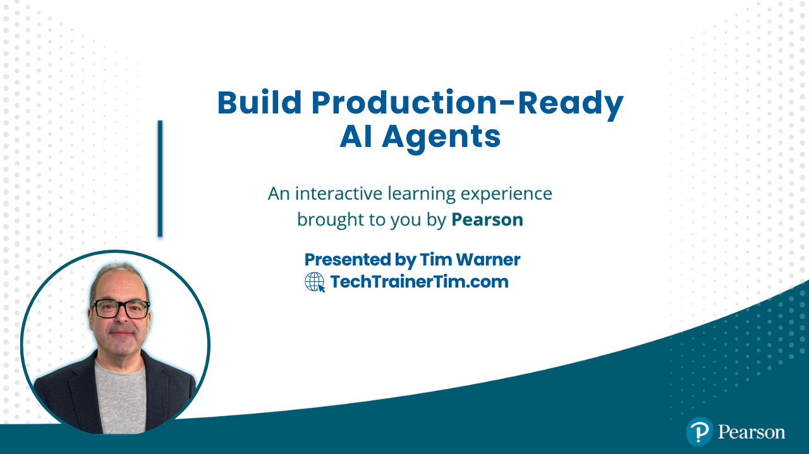

# Build Production-Ready AI Agents



[](https://techtrainertim.com) [](https://github.com/timothywarner-org) [](https://www.python.org/downloads/) [](LICENSE)

**O'Reilly Live Learning Course** | 4 Hours | LangGraph + CrewAI + MCP

Production-ready AI agents go beyond chatbots—they plan, execute, maintain state, and make decisions independently. Build autonomous agents using the enterprise stack that's actually shipping: **LangGraph** for stateful orchestration, **CrewAI** for multi-agent collaboration, and **Claude's Model Context Protocol (MCP)** for universal tool connectivity.

## Course Overview

| Segment | Focus | Difficulty | Key Skills |
|---------|-------|------------|------------|
| Segment 1 | Agents vs "Agents" - Foundations | Intro | True agents vs chatbots, LangGraph basics, state management, cost analysis |
| Segment 2 | LangGraph Deep Dive | Intermediate | Complex graphs, state persistence, checkpointing, human-in-the-loop |
| Segment 3 | Multi-Agent Orchestration | Intermediate | CrewAI roles, delegation, collaboration patterns, conflict resolution |
| Segment 4 | MCP Servers & Production | Advanced | MCP architecture, tool connectivity, production concerns, evaluation |

## What You'll Build

A working **AI Software Development Team** with three collaborating agents:

| Agent | Role | Capabilities |
|-------|------|--------------|
| **Product Manager** | Requirements & Planning | Analyzes requests, creates specs, prioritizes tasks |
| **Developer** | Implementation | Writes code, follows patterns, handles edge cases |
| **QA Tester** | Quality Assurance | Reviews code, writes tests, validates functionality |

## Prerequisites

- Python 3.11+ with async/await proficiency
- Experience with ChatGPT, Claude, or similar LLMs
- Comfortable with pip, venv, environment variables
- Basic REST API and JSON knowledge

**Required API keys:**

| Resource | URL | Notes |
|----------|-----|-------|
| Anthropic API | <https://console.anthropic.com/> | Claude API (Pro account recommended) |
| OpenAI API | <https://platform.openai.com/> | For comparison demos |

## Repository Structure

```text
production-agents/
├── README.md                           # This file
├── CLAUDE.md                           # Claude Code instructions
├── requirements.txt                    # Python dependencies
├── pyproject.toml                      # Project configuration
├── .env.example                        # Environment template
│
├── segment_1_foundations/              # Agents vs "Agents" - Architecture
│   ├── 01_what_is_an_agent.py          # True agents vs prompted chatbots
│   ├── 02_langgraph_basics.py          # Nodes, edges, state management
│   ├── 03_first_stateful_agent.py      # Demo: Agent with memory
│   ├── 04_crewai_intro.py              # Role-based agents introduction
│   ├── 05_cost_analysis.py             # When agents are worth it
│   └── exercises/
│
├── segment_2_langgraph/                # LangGraph Deep Dive
│   ├── 01_complex_graphs.py            # Conditional edges and loops
│   ├── 02_state_persistence.py         # Checkpointing for durability
│   ├── 03_code_review_agent.py         # Demo: Context across files
│   ├── 04_error_handling.py            # Fallback strategies
│   ├── 05_human_in_loop.py             # Critical decision patterns
│   └── exercises/
│
├── segment_3_crewai/                   # Multi-Agent Orchestration
│   ├── 01_specialized_agents.py        # PM, Developer, QA roles
│   ├── 02_communication.py             # Delegation strategies
│   ├── 03_software_team_demo.py        # End-to-end feature completion
│   ├── 04_conflict_resolution.py       # Managing contradictions
│   ├── 05_parallel_execution.py        # Performance optimization
│   └── exercises/
│
├── segment_4_mcp/                      # MCP Servers & Production
│   ├── 01_mcp_architecture.py          # Universal tool protocol
│   ├── 02_database_server/             # Demo: MCP for database access
│   ├── 03_github_integration.py        # Connecting to GitHub
│   ├── 04_slack_integration.py         # Connecting to Slack
│   ├── 05_production_concerns.py       # Rate limits, costs, monitoring
│   ├── 06_evaluation_framework.py      # Metrics that matter
│   ├── 07_antipatterns.py              # When NOT to use agents
│   └── exercises/
│
├── projects/
│   └── ai_dev_team/                    # Main Course Project
│       ├── agents/                     # PM, Developer, QA implementations
│       ├── workflows/                  # Feature and bug fix workflows
│       ├── mcp_servers/                # GitHub and code analysis servers
│       └── examples/
│
├── scripts/
│   ├── verify_setup.py                 # Verify installation
│   └── cost_calculator.py              # Estimate API costs
│
├── docker/
│   ├── docker-compose.yml
│   └── mcp-servers/
│
└── docs/
    ├── SETUP.md
    ├── TROUBLESHOOTING.md
    └── ARCHITECTURE.md
```

## Quick Start

1. **Clone the repository**

   ```bash
   git clone https://github.com/timothywarner-org/production-agents.git
   cd production-agents
   ```

2. **Create virtual environment and install dependencies**

   ```bash
   python -m venv .venv
   source .venv/bin/activate  # On Windows: .venv\Scripts\activate
   pip install -r requirements.txt
   ```

3. **Configure environment and verify**

   ```bash
   cp .env.example .env
   # Edit .env with your API keys
   python -m scripts.verify_setup
   ```

## Segment Summaries

### Segment 1: Agents vs "Agents" - Foundations

**Scenario:** Understand what separates true autonomous agents from prompted chatbots

**What you'll learn:**

- The agent architecture spectrum (chatbots to fully autonomous)
- LangGraph fundamentals: nodes, edges, state
- When agents are worth the investment (cost analysis)
- Your first stateful agent with memory

**Skills:** Agent architecture, LangGraph basics, cost-benefit analysis

---

### Segment 2: LangGraph Deep Dive

**Scenario:** Build complex, production-grade agent workflows

**What you'll learn:**

- Conditional edges and looping patterns
- State persistence with checkpointing
- Error handling and fallback strategies
- Human-in-the-loop for critical decisions

**Skills:** Complex graphs, checkpointing, error handling, human oversight

---

### Segment 3: Multi-Agent Orchestration with CrewAI

**Scenario:** Orchestrate multiple specialized agents working together

**What you'll learn:**

- Role-based agent design (PM, Developer, QA)
- Communication and delegation strategies
- Managing agent disagreements
- Parallel vs sequential execution

**Skills:** CrewAI roles, delegation patterns, conflict resolution

---

### Segment 4: MCP Servers & Production

**Scenario:** Connect agents to real-world tools and prepare for production

**What you'll learn:**

- MCP architecture and universal tool protocol
- Building database, GitHub, and Slack integrations
- Production concerns: rate limits, costs, monitoring
- Evaluation framework and antipatterns

**Skills:** MCP servers, tool integration, production deployment, evaluation

## Key Code Examples

### LangGraph: Stateful Workflows

```python
from langgraph.graph import StateGraph, START, END
from langgraph.checkpoint.memory import MemorySaver

# Define state that persists across nodes
class AgentState(TypedDict):
    messages: list[BaseMessage]
    current_task: str
    decisions: list[str]

# Build graph with nodes and edges
graph = StateGraph(AgentState)
graph.add_node("analyze", analyze_task)
graph.add_node("execute", execute_task)
graph.add_node("validate", validate_result)

# Add conditional routing
graph.add_conditional_edges("analyze", route_by_complexity)

# Enable persistence
memory = MemorySaver()
app = graph.compile(checkpointer=memory)
```

### CrewAI: Multi-Agent Collaboration

```python
from crewai import Agent, Task, Crew

# Define specialized agents
pm = Agent(
    role="Product Manager",
    goal="Define clear requirements and acceptance criteria",
    backstory="Experienced PM who bridges technical and business needs"
)

developer = Agent(
    role="Senior Developer",
    goal="Implement clean, tested code that meets requirements",
    backstory="Pragmatic engineer focused on maintainable solutions"
)

# Create collaborative crew
crew = Crew(
    agents=[pm, developer],
    tasks=[requirements_task, implementation_task],
    process=Process.sequential  # or Process.hierarchical
)
```

### Claude MCP: Universal Tool Protocol

```python
from mcp.server import Server
from mcp.types import Tool

# Create MCP server
server = Server("database-tools")

@server.tool()
async def query_database(sql: str) -> str:
    """Execute a read-only SQL query"""
    # Connect agents to your database
    return await execute_query(sql)

@server.tool()
async def get_schema(table: str) -> str:
    """Get schema for a database table"""
    return await fetch_schema(table)
```

## Decision Framework

| Use Case | Agent? | Why |
|----------|--------|-----|
| Multi-step reasoning with context | Yes | Agents excel at maintaining state |
| Dynamic tool selection | Yes | Agents can choose appropriate tools |
| Simple, predictable workflows | No | Traditional automation is cheaper |
| High-stakes with no review | No | Agents need human oversight |
| One-off data transformation | No | Scripts are more efficient |

## Learning Resources

### Agent Frameworks

- [LangGraph Documentation](https://langchain-ai.github.io/langgraph/)
- [CrewAI Documentation](https://docs.crewai.com/)
- [Model Context Protocol](https://modelcontextprotocol.io/)
- [Anthropic API Reference](https://docs.anthropic.com/)

### Related O'Reilly Content

- [How to Prompt Like a Pro](https://learning.oreilly.com/) — Tim Warner
- [AI Agents at Work](https://learning.oreilly.com/) — Shaun Wassell
- [AI Catalyst: Enterprise Agent Deployments](https://learning.oreilly.com/) — Jon Krohn

## Course Schedule

| Time | Activity |
|------|----------|
| 0:00 - 0:50 | Segment 1: Agents vs "Agents" - Foundations |
| 0:50 - 1:00 | Q&A + Break |
| 1:00 - 1:50 | Segment 2: LangGraph Deep Dive |
| 1:50 - 2:00 | Q&A + Break |
| 2:00 - 2:50 | Segment 3: Multi-Agent Orchestration with CrewAI |
| 2:50 - 3:00 | Q&A + Break |
| 3:00 - 3:50 | Segment 4: MCP Servers & Production |
| 3:50 - 4:00 | Wrap-up, resources, next steps |

## Troubleshooting

See [TROUBLESHOOTING.md](docs/TROUBLESHOOTING.md) for common issues.

**Quick fixes:**

```bash
# API key issues
echo $ANTHROPIC_API_KEY  # Verify it's set

# Package conflicts
pip install --upgrade langgraph crewai anthropic

# MCP server won't start
docker-compose logs mcp-server
```

## Instructor

**Tim Warner** — Microsoft MVP (Azure AI and Cloud/Datacenter Management), Microsoft Certified Trainer (25+ years)

- [LinkedIn](https://www.linkedin.com/in/intrepidtechie/)
- [Website](https://techtrainertim.com/)
- [O'Reilly Author Page](https://learning.oreilly.com/search/?query=Tim%20Warner)

## License

MIT License - See [LICENSE](./LICENSE) for details.

---

**Questions?** Open an issue or reach out via the course chat during live sessions.
