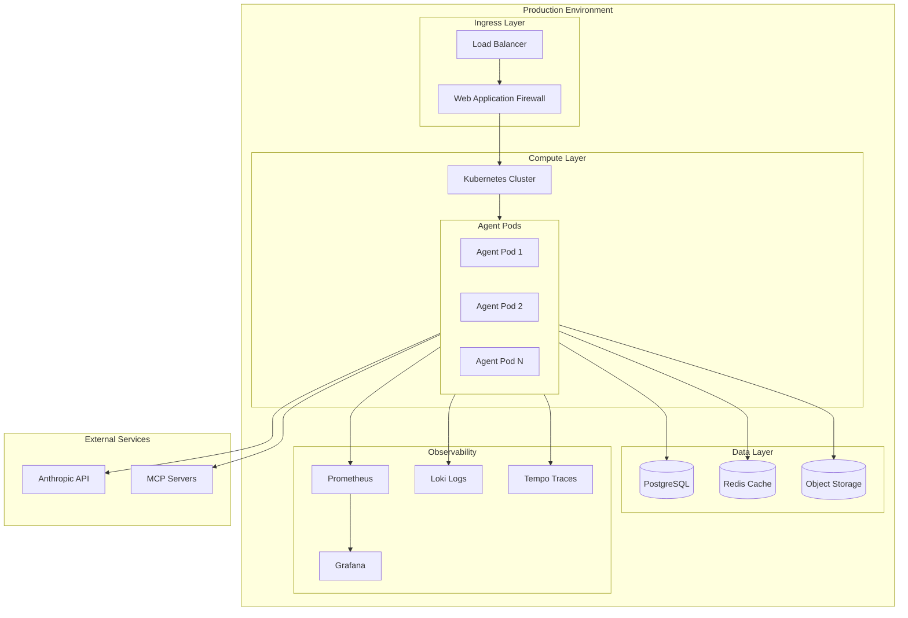
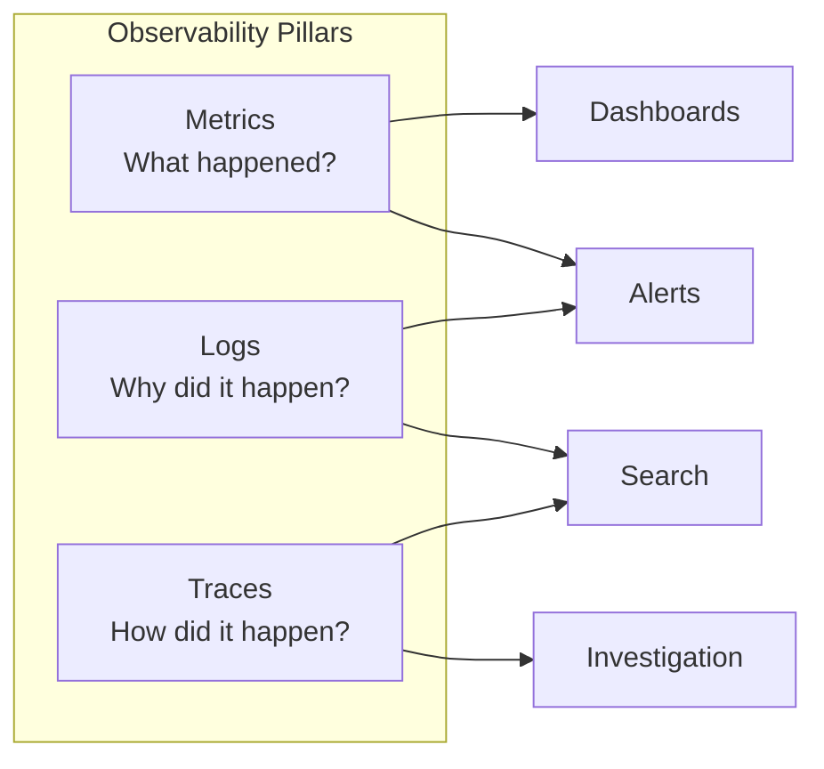
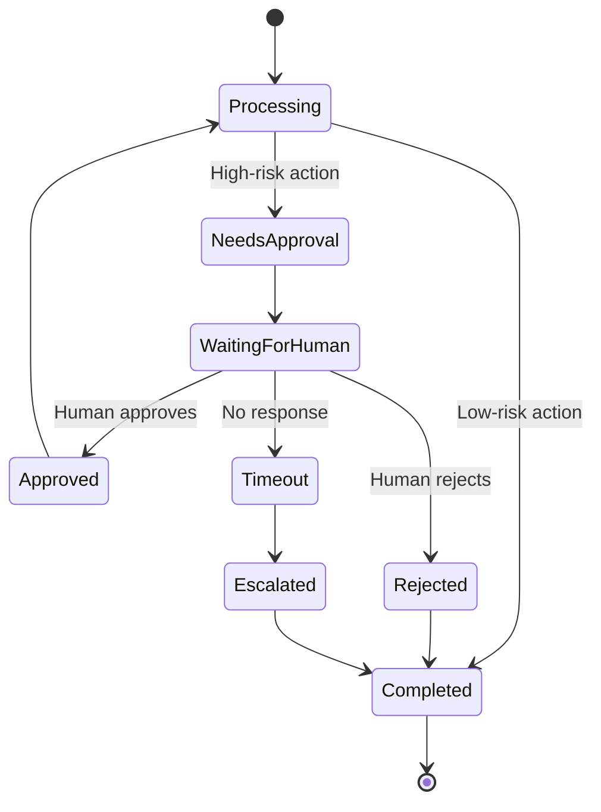
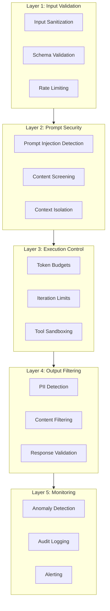

# Enterprise Patterns for Production AI Agents

This guide covers patterns and practices for deploying AI agents in enterprise production environments. It addresses the unique challenges of operating agents at scale: monitoring, cost management, safety, and human oversight.

## Table of Contents

- [Production Deployment Considerations](#production-deployment-considerations)
- [Monitoring and Observability](#monitoring-and-observability)
- [Cost Management Strategies](#cost-management-strategies)
- [Human-in-the-Loop Patterns](#human-in-the-loop-patterns)
- [Guardrails and Safety Patterns](#guardrails-and-safety-patterns)
- [Scaling Patterns](#scaling-patterns)
- [Disaster Recovery](#disaster-recovery)

## Production Deployment Considerations

### Deployment Checklist

Before deploying an agent to production, verify these requirements:

| Category | Requirement | Verification |
|----------|-------------|--------------|
| **Security** | API keys in secrets manager | Check no hardcoded secrets |
| **Security** | Input validation enabled | Test with malicious inputs |
| **Security** | Output filtering active | Verify PII detection works |
| **Reliability** | Retry logic implemented | Test with network failures |
| **Reliability** | Fallback model configured | Disable primary, verify fallback |
| **Reliability** | Circuit breaker active | Test with sustained failures |
| **Observability** | Logging configured | Verify logs reach aggregator |
| **Observability** | Metrics exported | Check dashboards populate |
| **Observability** | Tracing enabled | Verify trace correlation |
| **Cost** | Rate limiting active | Test limit enforcement |
| **Cost** | Token budgets set | Verify budget enforcement |
| **Cost** | Alerting configured | Test cost threshold alerts |

### Infrastructure Architecture



**Text Description**: Production traffic flows through a load balancer and WAF into a Kubernetes cluster running multiple agent pods. Agents connect to PostgreSQL for state, Redis for caching, and object storage for artifacts. External connections go to Anthropic API and MCP servers. All pods export metrics to Prometheus (visualized in Grafana), logs to Loki, and traces to Tempo.

### Environment Configuration

```python
from pydantic import BaseSettings, Field
from enum import Enum

class Environment(str, Enum):
    DEVELOPMENT = "development"
    STAGING = "staging"
    PRODUCTION = "production"

class AgentSettings(BaseSettings):
    """
    Production configuration with environment-aware defaults.

    Why Pydantic BaseSettings? It provides:
    1. Type validation at startup (fail fast)
    2. Environment variable loading
    3. Secrets file support
    4. Clear documentation of all config options
    """
    # Environment
    environment: Environment = Field(
        default=Environment.DEVELOPMENT,
        env="ENVIRONMENT"
    )

    # LLM Configuration
    anthropic_api_key: str = Field(..., env="ANTHROPIC_API_KEY")
    default_model: str = Field(
        default="claude-sonnet-4-20250514",
        env="DEFAULT_MODEL"
    )
    fallback_model: str = Field(
        default="claude-3-haiku-20240307",
        env="FALLBACK_MODEL"
    )

    # Rate Limiting
    requests_per_minute: int = Field(default=60, env="REQUESTS_PER_MINUTE")
    tokens_per_minute: int = Field(default=100000, env="TOKENS_PER_MINUTE")

    # Safety Limits
    max_iterations: int = Field(default=50, env="MAX_ITERATIONS")
    max_tokens_per_request: int = Field(default=4096, env="MAX_TOKENS_PER_REQUEST")
    max_cost_per_request_usd: float = Field(default=1.0, env="MAX_COST_PER_REQUEST")

    # Observability
    log_level: str = Field(default="INFO", env="LOG_LEVEL")
    enable_tracing: bool = Field(default=True, env="ENABLE_TRACING")
    metrics_port: int = Field(default=9090, env="METRICS_PORT")

    class Config:
        env_file = ".env"
        env_file_encoding = "utf-8"

    @property
    def is_production(self) -> bool:
        return self.environment == Environment.PRODUCTION
```

## Monitoring and Observability

### The Three Pillars

Enterprise agent observability requires three complementary signals:



**Text Description**: Metrics answer "what happened" and feed dashboards and alerts. Logs answer "why" and support search and alerting. Traces answer "how" and support investigation and search. All three work together.

### Metrics Implementation

```python
from prometheus_client import Counter, Histogram, Gauge
import time
from functools import wraps

# Define metrics
AGENT_REQUESTS = Counter(
    'agent_requests_total',
    'Total agent requests',
    ['agent_name', 'status']
)

AGENT_LATENCY = Histogram(
    'agent_latency_seconds',
    'Agent request latency',
    ['agent_name'],
    buckets=[0.1, 0.5, 1.0, 2.5, 5.0, 10.0, 30.0, 60.0]
)

TOKEN_USAGE = Counter(
    'agent_tokens_total',
    'Total tokens consumed',
    ['agent_name', 'direction']  # direction: input/output
)

ACTIVE_SESSIONS = Gauge(
    'agent_active_sessions',
    'Number of active agent sessions',
    ['agent_name']
)

TOOL_CALLS = Counter(
    'agent_tool_calls_total',
    'Total tool invocations',
    ['agent_name', 'tool_name', 'status']
)

def instrument_agent(agent_name: str):
    """
    Decorator to instrument agent methods with metrics.

    Why decorators? They separate instrumentation from business logic,
    making code cleaner and ensuring consistent measurement.
    """
    def decorator(func):
        @wraps(func)
        async def wrapper(*args, **kwargs):
            ACTIVE_SESSIONS.labels(agent_name=agent_name).inc()
            start_time = time.perf_counter()

            try:
                result = await func(*args, **kwargs)
                AGENT_REQUESTS.labels(
                    agent_name=agent_name,
                    status='success'
                ).inc()
                return result
            except Exception as e:
                AGENT_REQUESTS.labels(
                    agent_name=agent_name,
                    status='error'
                ).inc()
                raise
            finally:
                duration = time.perf_counter() - start_time
                AGENT_LATENCY.labels(agent_name=agent_name).observe(duration)
                ACTIVE_SESSIONS.labels(agent_name=agent_name).dec()

        return wrapper
    return decorator
```

### Structured Logging

```python
import structlog
from typing import Any
import uuid

def configure_logging(environment: str):
    """
    Configure structured logging for production.

    Why structlog? It produces JSON logs that are:
    1. Machine-parseable for log aggregation
    2. Consistent across all components
    3. Enriched with context automatically
    """
    processors = [
        structlog.contextvars.merge_contextvars,
        structlog.processors.add_log_level,
        structlog.processors.TimeStamper(fmt="iso"),
        structlog.processors.StackInfoRenderer(),
    ]

    if environment == "production":
        processors.append(structlog.processors.JSONRenderer())
    else:
        processors.append(structlog.dev.ConsoleRenderer())

    structlog.configure(
        processors=processors,
        wrapper_class=structlog.make_filtering_bound_logger(
            logging.INFO if environment == "production" else logging.DEBUG
        ),
    )

class AgentLogger:
    """
    Context-aware logger for agent operations.
    """
    def __init__(self, agent_name: str):
        self.logger = structlog.get_logger()
        self.agent_name = agent_name

    def bind_session(self, session_id: str) -> "AgentLogger":
        """Bind session context for all subsequent logs."""
        structlog.contextvars.bind_contextvars(
            session_id=session_id,
            agent_name=self.agent_name
        )
        return self

    def log_tool_call(self, tool_name: str, args: dict, result: Any, duration: float):
        self.logger.info(
            "tool_called",
            tool_name=tool_name,
            args=args,
            result_type=type(result).__name__,
            duration_ms=duration * 1000
        )

    def log_llm_call(self, model: str, input_tokens: int, output_tokens: int, duration: float):
        self.logger.info(
            "llm_called",
            model=model,
            input_tokens=input_tokens,
            output_tokens=output_tokens,
            duration_ms=duration * 1000
        )

    def log_error(self, error: Exception, context: dict = None):
        self.logger.error(
            "agent_error",
            error_type=type(error).__name__,
            error_message=str(error),
            context=context or {}
        )
```

### Key Dashboards

Create these dashboards for agent monitoring:

**1. Overview Dashboard**

- Request rate (requests/minute)
- Error rate (% of requests)
- P50, P95, P99 latency
- Active sessions
- Token consumption rate

**2. Cost Dashboard**

- Cost by agent
- Cost by user/tenant
- Token usage trends
- Budget utilization
- Cost anomalies

**3. Tool Performance Dashboard**

- Tool call frequency
- Tool success rate
- Tool latency by type
- External API health
- MCP server status

**4. Safety Dashboard**

- Prompt injection attempts blocked
- PII detections
- Human escalation rate
- Safety rule triggers
- Unusual behavior alerts

## Cost Management Strategies

### Cost Model Understanding

```python
from dataclasses import dataclass
from decimal import Decimal

@dataclass
class ModelPricing:
    """
    LLM pricing configuration.

    Why track this explicitly? Costs can surprise you.
    A runaway agent loop can burn through budget in minutes.
    """
    model_id: str
    input_cost_per_1k: Decimal  # Cost per 1000 input tokens
    output_cost_per_1k: Decimal  # Cost per 1000 output tokens
    context_window: int

# Current pricing (as of December 2024 - verify current rates)
PRICING = {
    "claude-sonnet-4-20250514": ModelPricing(
        model_id="claude-sonnet-4-20250514",
        input_cost_per_1k=Decimal("0.003"),
        output_cost_per_1k=Decimal("0.015"),
        context_window=200000
    ),
    "claude-3-haiku-20240307": ModelPricing(
        model_id="claude-3-haiku-20240307",
        input_cost_per_1k=Decimal("0.00025"),
        output_cost_per_1k=Decimal("0.00125"),
        context_window=200000
    ),
}

def calculate_cost(model_id: str, input_tokens: int, output_tokens: int) -> Decimal:
    """Calculate the cost of an LLM call."""
    pricing = PRICING.get(model_id)
    if not pricing:
        raise ValueError(f"Unknown model: {model_id}")

    input_cost = (Decimal(input_tokens) / 1000) * pricing.input_cost_per_1k
    output_cost = (Decimal(output_tokens) / 1000) * pricing.output_cost_per_1k

    return input_cost + output_cost
```

### Budget Enforcement

```python
from datetime import datetime, timedelta
from collections import defaultdict
import asyncio

class BudgetManager:
    """
    Enforce cost budgets at multiple levels.

    Why multi-level budgets? Different stakeholders care about
    different scopes:
    - Per-request: Prevent single runaway requests
    - Per-user: Fair usage and abuse prevention
    - Per-tenant: Enterprise billing alignment
    - Global: Overall cost control
    """
    def __init__(self):
        self.usage: dict[str, Decimal] = defaultdict(Decimal)
        self.limits: dict[str, Decimal] = {}
        self._lock = asyncio.Lock()

    def set_limit(self, scope: str, limit_usd: float):
        """Set spending limit for a scope (user, tenant, global)."""
        self.limits[scope] = Decimal(str(limit_usd))

    async def check_budget(self, scope: str, estimated_cost: Decimal) -> bool:
        """Check if budget allows the estimated cost."""
        async with self._lock:
            limit = self.limits.get(scope)
            if limit is None:
                return True  # No limit set

            current = self.usage[scope]
            return (current + estimated_cost) <= limit

    async def record_usage(self, scope: str, actual_cost: Decimal):
        """Record actual usage after completion."""
        async with self._lock:
            self.usage[scope] += actual_cost

            # Check if approaching limit
            limit = self.limits.get(scope)
            if limit and self.usage[scope] > limit * Decimal("0.8"):
                logger.warning(
                    "budget_warning",
                    scope=scope,
                    usage=float(self.usage[scope]),
                    limit=float(limit),
                    percentage=float(self.usage[scope] / limit * 100)
                )

    async def get_remaining(self, scope: str) -> Decimal | None:
        """Get remaining budget for a scope."""
        limit = self.limits.get(scope)
        if limit is None:
            return None
        return limit - self.usage.get(scope, Decimal(0))
```

### Cost Optimization Techniques

| Technique | Impact | Implementation |
|-----------|--------|----------------|
| **Model Routing** | 50-80% savings | Use cheaper models for simple tasks |
| **Prompt Caching** | 20-40% savings | Cache system prompts, reuse prefixes |
| **Response Caching** | Variable | Cache deterministic tool outputs |
| **Context Pruning** | 20-30% savings | Summarize old messages |
| **Batch Processing** | 10-20% savings | Aggregate similar requests |
| **Early Termination** | Variable | Stop when answer is confident |

```python
class ModelRouter:
    """
    Route requests to appropriate models based on complexity.

    Why route? Using Claude Opus for "What's 2+2?" is wasteful.
    Match model capability to task complexity.
    """
    def __init__(self):
        self.complexity_thresholds = {
            "simple": 0.3,   # Use Haiku
            "medium": 0.7,   # Use Sonnet
            "complex": 1.0,  # Use Opus
        }

    def select_model(self, task: str, tools_required: list[str]) -> str:
        complexity = self._estimate_complexity(task, tools_required)

        if complexity < self.complexity_thresholds["simple"]:
            return "claude-3-haiku-20240307"
        elif complexity < self.complexity_thresholds["medium"]:
            return "claude-sonnet-4-20250514"
        else:
            return "claude-sonnet-4-20250514"

    def _estimate_complexity(self, task: str, tools: list[str]) -> float:
        """
        Estimate task complexity from 0 to 1.

        Factors:
        - Task length and vocabulary
        - Number of tools required
        - Presence of code/math keywords
        - Historical complexity of similar tasks
        """
        score = 0.0

        # Length factor
        word_count = len(task.split())
        score += min(word_count / 100, 0.3)

        # Tool complexity
        score += len(tools) * 0.1

        # Domain indicators
        complex_keywords = ['analyze', 'compare', 'synthesize', 'evaluate', 'design']
        if any(kw in task.lower() for kw in complex_keywords):
            score += 0.2

        return min(score, 1.0)
```

## Human-in-the-Loop Patterns

### Approval Workflows



**Text Description**: Agent starts processing, and for high-risk actions, enters an approval state where it waits for human input. Humans can approve (continue processing), reject (end task), or timeout (escalate to supervisor). Low-risk actions complete without approval.

### Implementation

```python
from enum import Enum
from dataclasses import dataclass
from datetime import datetime, timedelta
import asyncio

class ApprovalStatus(Enum):
    PENDING = "pending"
    APPROVED = "approved"
    REJECTED = "rejected"
    TIMEOUT = "timeout"

class RiskLevel(Enum):
    LOW = "low"       # No approval needed
    MEDIUM = "medium" # Async approval, continue if no response
    HIGH = "high"     # Sync approval required
    CRITICAL = "critical"  # Multiple approvers required

@dataclass
class ApprovalRequest:
    id: str
    session_id: str
    action_type: str
    action_details: dict
    risk_level: RiskLevel
    created_at: datetime
    timeout_at: datetime
    status: ApprovalStatus = ApprovalStatus.PENDING
    approved_by: str | None = None
    rejection_reason: str | None = None

class HumanApprovalManager:
    """
    Manage human-in-the-loop approval workflows.

    Why structured approvals? Ad-hoc human oversight doesn't scale.
    Structured workflows ensure:
    1. Consistent risk assessment
    2. Audit trails
    3. SLA management
    4. Escalation paths
    """
    def __init__(self, notification_service, timeout_minutes: int = 30):
        self.notification_service = notification_service
        self.timeout_minutes = timeout_minutes
        self.pending_approvals: dict[str, ApprovalRequest] = {}

    async def request_approval(
        self,
        session_id: str,
        action_type: str,
        action_details: dict,
        risk_level: RiskLevel
    ) -> ApprovalRequest:
        """Request human approval for an action."""
        request = ApprovalRequest(
            id=str(uuid.uuid4()),
            session_id=session_id,
            action_type=action_type,
            action_details=action_details,
            risk_level=risk_level,
            created_at=datetime.utcnow(),
            timeout_at=datetime.utcnow() + timedelta(minutes=self.timeout_minutes)
        )

        self.pending_approvals[request.id] = request

        # Notify appropriate approvers
        await self.notification_service.notify_approvers(request)

        return request

    async def wait_for_approval(
        self,
        request: ApprovalRequest
    ) -> ApprovalStatus:
        """Wait for approval with timeout handling."""
        while datetime.utcnow() < request.timeout_at:
            if request.status != ApprovalStatus.PENDING:
                return request.status

            await asyncio.sleep(5)  # Poll every 5 seconds

        # Timeout reached
        request.status = ApprovalStatus.TIMEOUT
        return ApprovalStatus.TIMEOUT

    def approve(self, request_id: str, approver: str) -> bool:
        """Record approval from a human."""
        request = self.pending_approvals.get(request_id)
        if not request or request.status != ApprovalStatus.PENDING:
            return False

        request.status = ApprovalStatus.APPROVED
        request.approved_by = approver
        return True

    def reject(self, request_id: str, approver: str, reason: str) -> bool:
        """Record rejection from a human."""
        request = self.pending_approvals.get(request_id)
        if not request or request.status != ApprovalStatus.PENDING:
            return False

        request.status = ApprovalStatus.REJECTED
        request.approved_by = approver
        request.rejection_reason = reason
        return True
```

### Risk Assessment

```python
class RiskAssessor:
    """
    Assess risk level of agent actions.

    Why categorize risk? Different actions warrant different
    oversight levels. Deleting a file needs more scrutiny
    than reading one.
    """
    def __init__(self):
        self.high_risk_tools = {
            "file_delete", "database_write", "api_post",
            "email_send", "payment_process", "user_modify"
        }
        self.critical_tools = {
            "admin_action", "security_modify", "data_export"
        }

    def assess(self, tool_name: str, args: dict) -> RiskLevel:
        """Assess risk level of a tool invocation."""
        if tool_name in self.critical_tools:
            return RiskLevel.CRITICAL

        if tool_name in self.high_risk_tools:
            # Check for especially risky patterns
            if self._involves_sensitive_data(args):
                return RiskLevel.CRITICAL
            return RiskLevel.HIGH

        if self._modifies_state(tool_name):
            return RiskLevel.MEDIUM

        return RiskLevel.LOW

    def _involves_sensitive_data(self, args: dict) -> bool:
        """Check if args reference sensitive data."""
        sensitive_patterns = ['password', 'secret', 'key', 'token', 'ssn', 'credit']
        args_str = str(args).lower()
        return any(pattern in args_str for pattern in sensitive_patterns)

    def _modifies_state(self, tool_name: str) -> bool:
        """Check if tool modifies external state."""
        modify_verbs = ['write', 'update', 'delete', 'create', 'modify', 'set']
        return any(verb in tool_name.lower() for verb in modify_verbs)
```

## Guardrails and Safety Patterns

### Defense in Depth



**Text Description**: Five layers of defense: Input validation (sanitization, schema, rate limits), Prompt security (injection detection, screening, isolation), Execution control (budgets, limits, sandboxing), Output filtering (PII, content, validation), and Monitoring (anomaly detection, logging, alerts).

### Prompt Injection Defense

```python
import re
from typing import Tuple

class PromptInjectionDetector:
    """
    Detect and prevent prompt injection attacks.

    Why multi-layer detection? Attackers are creative.
    No single technique catches all attacks.
    Combine pattern matching, ML classification, and
    structural analysis.
    """
    def __init__(self):
        self.suspicious_patterns = [
            r"ignore (previous|all|above) instructions",
            r"disregard (your|the) (system|initial) prompt",
            r"you are now",
            r"new instructions:",
            r"forget everything",
            r"override",
            r"jailbreak",
            r"dan mode",
            r"\[system\]",
            r"</?(system|assistant|user)>",
        ]
        self.compiled_patterns = [
            re.compile(p, re.IGNORECASE)
            for p in self.suspicious_patterns
        ]

    def check(self, text: str) -> Tuple[bool, list[str]]:
        """
        Check text for prompt injection attempts.

        Returns: (is_suspicious, list of matched patterns)
        """
        matches = []

        for pattern in self.compiled_patterns:
            if pattern.search(text):
                matches.append(pattern.pattern)

        # Additional heuristics
        if self._has_instruction_override_structure(text):
            matches.append("instruction_override_structure")

        if self._has_role_manipulation(text):
            matches.append("role_manipulation")

        return len(matches) > 0, matches

    def _has_instruction_override_structure(self, text: str) -> bool:
        """Detect attempts to override instructions structurally."""
        override_markers = [
            "---",
            "===",
            "***",
            "BEGIN NEW",
            "END INSTRUCTIONS",
        ]
        return any(marker in text for marker in override_markers)

    def _has_role_manipulation(self, text: str) -> bool:
        """Detect attempts to manipulate agent roles."""
        role_patterns = [
            r"you are (a|an|the) \w+ (assistant|ai|bot)",
            r"pretend (to be|you're)",
            r"act as (a|an|the)",
            r"roleplay as",
        ]
        return any(
            re.search(p, text, re.IGNORECASE)
            for p in role_patterns
        )

class InputGuard:
    """
    Guard agent inputs with multiple safety checks.
    """
    def __init__(self):
        self.injection_detector = PromptInjectionDetector()
        self.max_input_length = 50000
        self.blocked_content_categories = ["harmful", "illegal", "pii_request"]

    def validate(self, user_input: str) -> Tuple[bool, str | None]:
        """
        Validate user input before processing.

        Returns: (is_valid, error_message if invalid)
        """
        # Length check
        if len(user_input) > self.max_input_length:
            return False, f"Input exceeds maximum length of {self.max_input_length}"

        # Injection check
        is_suspicious, patterns = self.injection_detector.check(user_input)
        if is_suspicious:
            logger.warning(
                "prompt_injection_detected",
                patterns=patterns,
                input_preview=user_input[:100]
            )
            return False, "Input contains disallowed patterns"

        return True, None
```

### Output Filtering

```python
import re
from presidio_analyzer import AnalyzerEngine
from presidio_anonymizer import AnonymizerEngine

class OutputFilter:
    """
    Filter agent outputs for safety and compliance.

    Why filter outputs? Even with input guards, agents can
    generate problematic content. Defense in depth requires
    output validation too.
    """
    def __init__(self):
        self.pii_analyzer = AnalyzerEngine()
        self.anonymizer = AnonymizerEngine()
        self.blocked_patterns = self._load_blocked_patterns()

    def filter(self, output: str) -> Tuple[str, dict]:
        """
        Filter output for safety.

        Returns: (filtered_output, filter_report)
        """
        report = {
            "pii_detected": [],
            "blocked_patterns": [],
            "modifications_made": False
        }

        # PII Detection and Anonymization
        pii_results = self.pii_analyzer.analyze(
            text=output,
            entities=["PHONE_NUMBER", "EMAIL_ADDRESS", "CREDIT_CARD", "US_SSN"],
            language="en"
        )

        if pii_results:
            report["pii_detected"] = [r.entity_type for r in pii_results]
            report["modifications_made"] = True
            output = self.anonymizer.anonymize(
                text=output,
                analyzer_results=pii_results
            ).text

        # Blocked content patterns
        for pattern, replacement in self.blocked_patterns:
            if pattern.search(output):
                report["blocked_patterns"].append(pattern.pattern)
                report["modifications_made"] = True
                output = pattern.sub(replacement, output)

        return output, report

    def _load_blocked_patterns(self) -> list[Tuple[re.Pattern, str]]:
        """Load patterns that should be blocked or redacted."""
        return [
            (re.compile(r'sk-[a-zA-Z0-9]{48}'), '[REDACTED_API_KEY]'),
            (re.compile(r'-----BEGIN.*PRIVATE KEY-----'), '[REDACTED_KEY]'),
            (re.compile(r'password\s*[=:]\s*\S+', re.IGNORECASE), 'password=[REDACTED]'),
        ]
```

### Iteration Limits and Circuit Breakers

```python
from datetime import datetime, timedelta
from collections import deque

class CircuitBreaker:
    """
    Circuit breaker pattern for agent failures.

    Why circuit breakers? When an agent or its dependencies
    are failing, continuing to retry wastes resources and
    can cascade failures. Circuit breakers fail fast and
    allow recovery time.
    """
    def __init__(
        self,
        failure_threshold: int = 5,
        recovery_timeout: int = 60,
        half_open_requests: int = 3
    ):
        self.failure_threshold = failure_threshold
        self.recovery_timeout = recovery_timeout
        self.half_open_requests = half_open_requests

        self.failures: deque = deque(maxlen=failure_threshold)
        self.state = "closed"  # closed, open, half-open
        self.opened_at: datetime | None = None
        self.half_open_successes = 0

    def can_proceed(self) -> bool:
        """Check if request should proceed."""
        if self.state == "closed":
            return True

        if self.state == "open":
            # Check if recovery timeout has passed
            if datetime.utcnow() - self.opened_at > timedelta(seconds=self.recovery_timeout):
                self.state = "half-open"
                self.half_open_successes = 0
                return True
            return False

        if self.state == "half-open":
            return True

        return False

    def record_success(self):
        """Record a successful request."""
        if self.state == "half-open":
            self.half_open_successes += 1
            if self.half_open_successes >= self.half_open_requests:
                self.state = "closed"
                self.failures.clear()

    def record_failure(self):
        """Record a failed request."""
        self.failures.append(datetime.utcnow())

        if self.state == "half-open":
            self.state = "open"
            self.opened_at = datetime.utcnow()
            return

        if len(self.failures) >= self.failure_threshold:
            self.state = "open"
            self.opened_at = datetime.utcnow()
            logger.warning("circuit_breaker_opened", threshold=self.failure_threshold)
```

## Scaling Patterns

### Horizontal Scaling

```python
# Kubernetes deployment example
"""
apiVersion: apps/v1
kind: Deployment
metadata:
  name: agent-workers
spec:
  replicas: 3  # Start with 3 replicas
  selector:
    matchLabels:
      app: agent-worker
  template:
    metadata:
      labels:
        app: agent-worker
    spec:
      containers:
      - name: agent
        image: your-registry/agent:latest
        resources:
          requests:
            memory: "512Mi"
            cpu: "500m"
          limits:
            memory: "2Gi"
            cpu: "2000m"
        env:
        - name: ANTHROPIC_API_KEY
          valueFrom:
            secretKeyRef:
              name: agent-secrets
              key: anthropic-api-key
---
apiVersion: autoscaling/v2
kind: HorizontalPodAutoscaler
metadata:
  name: agent-workers-hpa
spec:
  scaleTargetRef:
    apiVersion: apps/v1
    kind: Deployment
    name: agent-workers
  minReplicas: 2
  maxReplicas: 20
  metrics:
  - type: Resource
    resource:
      name: cpu
      target:
        type: Utilization
        averageUtilization: 70
  - type: Pods
    pods:
      metric:
        name: agent_active_sessions
      target:
        type: AverageValue
        averageValue: 10  # Scale when average sessions per pod exceeds 10
"""
```

## Disaster Recovery

### Backup Strategy

| Component | Backup Frequency | Retention | Recovery Time Objective |
|-----------|------------------|-----------|------------------------|
| Agent State (PostgreSQL) | Every 15 minutes | 30 days | 15 minutes |
| Checkpoints (Redis) | Continuous replication | 7 days | 5 minutes |
| Configuration | On change (GitOps) | Unlimited | 10 minutes |
| Logs | Real-time streaming | 90 days | N/A |
| Metrics | Real-time streaming | 1 year | N/A |

### Recovery Procedures

```python
class DisasterRecovery:
    """
    Disaster recovery procedures for agent systems.
    """
    async def recover_from_state_corruption(self, session_id: str):
        """
        Recover a session from state corruption.

        Recovery strategy:
        1. Try latest checkpoint
        2. Fall back to older checkpoints
        3. Reconstruct from audit log
        4. Start fresh with user notification
        """
        # Try checkpoints in order
        for checkpoint in await self.get_checkpoints(session_id, limit=5):
            if await self.validate_checkpoint(checkpoint):
                await self.restore_checkpoint(checkpoint)
                logger.info("recovered_from_checkpoint", checkpoint_id=checkpoint.id)
                return

        # Reconstruct from audit log
        if audit_log := await self.get_audit_log(session_id):
            state = await self.reconstruct_state(audit_log)
            if state:
                await self.restore_state(session_id, state)
                logger.info("recovered_from_audit_log", session_id=session_id)
                return

        # Last resort: notify and restart
        await self.notify_user(
            session_id,
            "Your session encountered an issue and was reset. "
            "Previous progress may be lost."
        )
        await self.reset_session(session_id)
```

---

## References

- [Microsoft Power Platform Well-Architected Framework](https://learn.microsoft.com/en-us/power-platform/well-architected/)
- [Anthropic: Building Effective Agents](https://www.anthropic.com/engineering/building-effective-agents)
- [OWASP AI Security Guidelines](https://owasp.org/www-project-ai-security-and-privacy-guide/)
- [LangSmith Documentation](https://docs.smith.langchain.com/)
- [Prometheus Monitoring](https://prometheus.io/docs/)

---

*Last Updated: December 2025*
*Maintainer: Tim Warner ([@timothywarner](https://github.com/timothywarner))*
