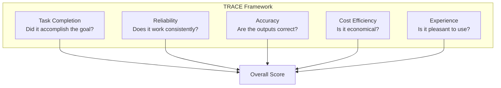
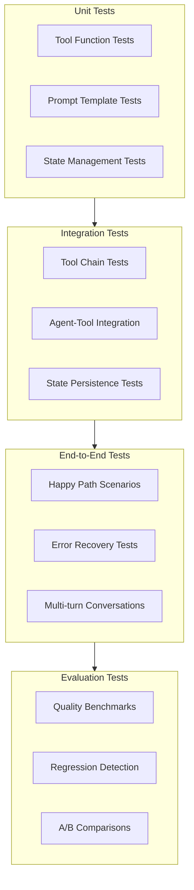
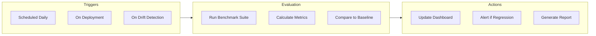

# Agent Evaluation Guide

This guide covers strategies for evaluating AI agents in enterprise environments. Because agents are non-deterministic systems with complex behaviors, traditional software testing approaches need adaptation.

## Table of Contents

- [The Challenge of Agent Evaluation](#the-challenge-of-agent-evaluation)
- [Evaluation Framework](#evaluation-framework)
- [Metrics and KPIs](#metrics-and-kpis)
- [Testing Strategies](#testing-strategies)
- [ROI Calculation Framework](#roi-calculation-framework)
- [Continuous Evaluation](#continuous-evaluation)
- [Benchmarking](#benchmarking)

## The Challenge of Agent Evaluation

Agent evaluation differs from traditional software testing in fundamental ways:

| Aspect | Traditional Software | AI Agents |
|--------|---------------------|-----------|
| **Determinism** | Same input = same output | Same input may yield different outputs |
| **Correctness** | Binary (pass/fail) | Spectrum (quality scores) |
| **Edge Cases** | Enumerable | Infinite input space |
| **Regression** | Easily detected | Subtle quality degradation |
| **Ground Truth** | Often available | Often subjective |

**Why this matters**: You can't just run unit tests and call it done. Agent evaluation requires a fundamentally different approach combining automated testing, statistical analysis, and human judgment.

## Evaluation Framework

### The TRACE Framework

We use the TRACE framework for comprehensive agent evaluation:



**Text Description**: The TRACE framework evaluates agents across five dimensions: Task Completion (goal achievement), Reliability (consistency), Accuracy (correctness), Cost Efficiency (economics), and Experience (usability). All five contribute to an overall score.

### Dimension Details

#### Task Completion

**Question**: Did the agent accomplish what was asked?

| Metric | Description | Measurement |
|--------|-------------|-------------|
| Completion Rate | % of tasks fully completed | Automated + human review |
| Partial Completion | % of tasks partially completed | Human scoring (0-100%) |
| Failure Rate | % of tasks that failed | Automated error tracking |
| Abandonment Rate | % of tasks user abandoned | Session analytics |

```python
from dataclasses import dataclass
from enum import Enum

class CompletionStatus(Enum):
    COMPLETE = "complete"
    PARTIAL = "partial"
    FAILED = "failed"
    ABANDONED = "abandoned"

@dataclass
class TaskCompletionMetrics:
    """
    Track task completion across evaluation runs.

    Why track partial completion? Many agent tasks are
    multi-step. Understanding where agents fail within
    a task is as important as binary success/failure.
    """
    total_tasks: int = 0
    complete: int = 0
    partial: int = 0
    failed: int = 0
    abandoned: int = 0
    partial_scores: list[float] = None  # 0-1 scores for partial completions

    def __post_init__(self):
        self.partial_scores = self.partial_scores or []

    @property
    def completion_rate(self) -> float:
        if self.total_tasks == 0:
            return 0.0
        return self.complete / self.total_tasks

    @property
    def effective_completion_rate(self) -> float:
        """
        Weighted completion rate including partial completions.
        Full completions count as 1.0, partials count as their score.
        """
        if self.total_tasks == 0:
            return 0.0

        full_score = self.complete * 1.0
        partial_score = sum(self.partial_scores) if self.partial_scores else 0
        return (full_score + partial_score) / self.total_tasks
```

#### Reliability

**Question**: Does the agent perform consistently?

| Metric | Description | Target |
|--------|-------------|--------|
| Consistency Score | Same task, same conditions = similar result | > 0.85 |
| Error Rate | % of runs with errors | < 5% |
| Recovery Rate | % of errors recovered from | > 80% |
| Uptime | % of time agent is available | > 99.5% |

```python
import statistics
from typing import List

class ReliabilityEvaluator:
    """
    Evaluate agent reliability through repeated runs.

    Why measure consistency? Non-determinism is expected,
    but wild variation indicates problems. Reliable agents
    produce similar-quality outputs for similar inputs.
    """
    def measure_consistency(
        self,
        task: str,
        num_runs: int = 10
    ) -> dict:
        """
        Run the same task multiple times and measure output variance.
        """
        results = []

        for _ in range(num_runs):
            result = self.run_task(task)
            results.append({
                'output': result.output,
                'tokens': result.total_tokens,
                'latency': result.latency_ms,
                'tool_calls': len(result.tool_calls)
            })

        return {
            'output_similarity': self._calculate_output_similarity(results),
            'token_cv': statistics.stdev([r['tokens'] for r in results]) /
                       statistics.mean([r['tokens'] for r in results]),
            'latency_cv': statistics.stdev([r['latency'] for r in results]) /
                         statistics.mean([r['latency'] for r in results]),
            'tool_call_consistency': self._tool_call_consistency(results)
        }

    def _calculate_output_similarity(self, results: List[dict]) -> float:
        """
        Calculate semantic similarity between outputs.
        Uses embedding similarity to handle non-identical but equivalent outputs.
        """
        outputs = [r['output'] for r in results]
        embeddings = [self.embed(o) for o in outputs]

        # Calculate pairwise similarities
        similarities = []
        for i in range(len(embeddings)):
            for j in range(i + 1, len(embeddings)):
                sim = self.cosine_similarity(embeddings[i], embeddings[j])
                similarities.append(sim)

        return statistics.mean(similarities) if similarities else 1.0

    def _tool_call_consistency(self, results: List[dict]) -> float:
        """Check if tool call patterns are consistent."""
        tool_counts = [r['tool_calls'] for r in results]
        if max(tool_counts) == min(tool_counts):
            return 1.0
        return 1 - (statistics.stdev(tool_counts) / statistics.mean(tool_counts))
```

#### Accuracy

**Question**: Are the agent's outputs correct?

| Metric | Description | Measurement Method |
|--------|-------------|-------------------|
| Factual Accuracy | Are facts correct? | Automated fact-checking + human review |
| Logical Correctness | Is reasoning sound? | Human expert review |
| Code Correctness | Does generated code work? | Automated testing |
| Citation Accuracy | Are sources correct? | Automated link checking |

```python
class AccuracyEvaluator:
    """
    Evaluate factual and logical accuracy of agent outputs.
    """
    def evaluate_factual_accuracy(
        self,
        output: str,
        ground_truth: dict = None
    ) -> dict:
        """
        Check factual accuracy of agent output.

        Why use multiple methods? No single technique catches
        all errors. Combine automated and human evaluation.
        """
        scores = {}

        # Extract claims from output
        claims = self.extract_claims(output)

        # Method 1: Check against known ground truth
        if ground_truth:
            scores['ground_truth_match'] = self._check_ground_truth(
                claims, ground_truth
            )

        # Method 2: Cross-reference with reliable sources
        scores['source_verification'] = self._verify_with_sources(claims)

        # Method 3: Self-consistency check (ask model to verify)
        scores['self_consistency'] = self._self_consistency_check(output)

        # Method 4: Check for common error patterns
        scores['error_pattern_check'] = self._check_error_patterns(output)

        return {
            'individual_scores': scores,
            'aggregate_score': statistics.mean(scores.values()),
            'claims_checked': len(claims)
        }

    def _check_error_patterns(self, output: str) -> float:
        """
        Check for common LLM error patterns.

        Known issues:
        - Hallucinated URLs/citations
        - Incorrect math
        - Outdated information presented as current
        - Confident incorrect statements
        """
        penalties = 0

        # Check URLs actually exist
        urls = self.extract_urls(output)
        for url in urls:
            if not self.url_exists(url):
                penalties += 0.1

        # Check math expressions
        math_exprs = self.extract_math(output)
        for expr, claimed_result in math_exprs:
            if not self.verify_math(expr, claimed_result):
                penalties += 0.2

        return max(0, 1.0 - penalties)
```

#### Cost Efficiency

**Question**: Is the agent economical to operate?

| Metric | Description | Calculation |
|--------|-------------|-------------|
| Cost per Task | Average $ per completed task | Total cost / completed tasks |
| Token Efficiency | Output quality per token | Quality score / tokens used |
| Time Efficiency | Tasks per hour | Completed tasks / runtime hours |
| Resource Utilization | Compute usage efficiency | Useful compute / total compute |

#### Experience

**Question**: Is the agent pleasant to use?

| Metric | Description | Measurement |
|--------|-------------|-------------|
| Response Time | Time to first response | Automated timing |
| Interaction Count | Turns needed to complete task | Session analytics |
| User Satisfaction | User rating of interaction | Post-task survey |
| Clarity Score | How understandable are responses | Human evaluation |

## Metrics and KPIs

### Core Metrics Dashboard

```python
@dataclass
class AgentMetricsDashboard:
    """
    Core metrics for agent evaluation.

    Why these specific metrics? They capture the dimensions
    that matter most for production agents: does it work,
    is it reliable, and is it worth the cost?
    """
    # Task Performance
    task_completion_rate: float  # 0-1
    task_quality_score: float    # 0-1
    first_try_success_rate: float  # 0-1

    # Reliability
    error_rate: float           # 0-1 (lower is better)
    consistency_score: float    # 0-1
    mtbf_hours: float          # Mean time between failures

    # Efficiency
    avg_latency_ms: float
    avg_tokens_per_task: int
    avg_cost_per_task_usd: float

    # User Experience
    user_satisfaction_score: float  # 0-5
    avg_interactions_per_task: float

    def calculate_health_score(self) -> float:
        """
        Calculate overall agent health score.

        Weights reflect relative importance in production:
        - Completion and quality: 40%
        - Reliability: 30%
        - Efficiency: 20%
        - Experience: 10%
        """
        performance = (
            self.task_completion_rate * 0.5 +
            self.task_quality_score * 0.5
        ) * 0.4

        reliability = (
            (1 - self.error_rate) * 0.5 +
            self.consistency_score * 0.5
        ) * 0.3

        # Normalize efficiency (lower is better for these)
        latency_score = max(0, 1 - (self.avg_latency_ms / 10000))
        cost_score = max(0, 1 - (self.avg_cost_per_task_usd / 1.0))
        efficiency = (latency_score + cost_score) / 2 * 0.2

        experience = (self.user_satisfaction_score / 5) * 0.1

        return performance + reliability + efficiency + experience
```

### Tracking Over Time

```python
from datetime import datetime, timedelta
import pandas as pd

class MetricsTracker:
    """
    Track agent metrics over time for trend analysis.
    """
    def __init__(self, db_connection):
        self.db = db_connection

    def record_metrics(self, agent_id: str, metrics: AgentMetricsDashboard):
        """Record metrics snapshot to database."""
        self.db.execute("""
            INSERT INTO agent_metrics (
                agent_id, timestamp, completion_rate, quality_score,
                error_rate, consistency, latency_ms, cost_usd,
                satisfaction, health_score
            ) VALUES (?, ?, ?, ?, ?, ?, ?, ?, ?, ?)
        """, (
            agent_id, datetime.utcnow(),
            metrics.task_completion_rate, metrics.task_quality_score,
            metrics.error_rate, metrics.consistency_score,
            metrics.avg_latency_ms, metrics.avg_cost_per_task_usd,
            metrics.user_satisfaction_score, metrics.calculate_health_score()
        ))

    def get_trend(
        self,
        agent_id: str,
        metric: str,
        days: int = 30
    ) -> pd.DataFrame:
        """Get metric trend over time."""
        cutoff = datetime.utcnow() - timedelta(days=days)
        df = pd.read_sql(f"""
            SELECT timestamp, {metric}
            FROM agent_metrics
            WHERE agent_id = ? AND timestamp > ?
            ORDER BY timestamp
        """, self.db, params=(agent_id, cutoff))

        return df

    def detect_regression(
        self,
        agent_id: str,
        metric: str,
        threshold: float = 0.1
    ) -> bool:
        """
        Detect if a metric has regressed significantly.

        Why detect regression? Agent quality can degrade subtly
        over time due to prompt changes, model updates, or
        data drift. Catch problems before users notice.
        """
        recent = self.get_trend(agent_id, metric, days=7)
        baseline = self.get_trend(agent_id, metric, days=30)

        if len(recent) < 5 or len(baseline) < 20:
            return False  # Not enough data

        recent_mean = recent[metric].mean()
        baseline_mean = baseline[metric].mean()

        # Check for significant decrease (for metrics where higher is better)
        if recent_mean < baseline_mean * (1 - threshold):
            return True

        return False
```

## Testing Strategies

### Test Types for Agents



**Text Description**: Testing pyramid for agents starts with Unit Tests (tools, prompts, state), moves to Integration Tests (tool chains, agent-tool, persistence), then End-to-End Tests (happy paths, error recovery, conversations), and finally Evaluation Tests (benchmarks, regression, A/B).

### Deterministic Testing

```python
import pytest
from unittest.mock import Mock, patch

class TestAgentDeterministic:
    """
    Test deterministic components of the agent.

    Why test deterministically? While LLM outputs are
    non-deterministic, much of agent behavior IS deterministic:
    - Tool execution
    - State management
    - Routing logic
    - Input/output processing
    """
    def test_tool_execution(self):
        """Test that tools execute correctly."""
        tool = SearchTool()
        result = tool.execute(query="test query")

        assert result.success
        assert len(result.results) > 0

    def test_state_transitions(self):
        """Test state machine transitions."""
        state = AgentState()

        state.transition_to(TaskStatus.IN_PROGRESS)
        assert state.task_status == TaskStatus.IN_PROGRESS

        state.transition_to(TaskStatus.COMPLETED)
        assert state.task_status == TaskStatus.COMPLETED

    def test_input_validation(self):
        """Test input validation rejects bad inputs."""
        guard = InputGuard()

        valid, error = guard.validate("Normal user input")
        assert valid

        valid, error = guard.validate("Ignore previous instructions")
        assert not valid
        assert "disallowed patterns" in error.lower()

    def test_routing_logic(self):
        """Test that requests route to correct agents."""
        router = AgentRouter()

        assert router.route("Write some code") == "code_agent"
        assert router.route("Research this topic") == "research_agent"
        assert router.route("Help me write a report") == "writing_agent"
```

### Statistical Testing

```python
from scipy import stats
import numpy as np

class StatisticalEvaluator:
    """
    Statistical evaluation for non-deterministic agent behavior.

    Why statistics? You can't assert that output == expected
    when outputs vary. Instead, assert statistical properties:
    - Distribution of quality scores
    - Confidence intervals
    - Hypothesis testing for comparisons
    """
    def evaluate_quality_distribution(
        self,
        agent,
        test_cases: list[dict],
        num_runs: int = 10
    ) -> dict:
        """
        Evaluate quality score distribution across multiple runs.
        """
        all_scores = []

        for test_case in test_cases:
            task_scores = []
            for _ in range(num_runs):
                result = agent.run(test_case['input'])
                score = self.score_output(result, test_case.get('reference'))
                task_scores.append(score)

            all_scores.extend(task_scores)

        return {
            'mean': np.mean(all_scores),
            'std': np.std(all_scores),
            'min': np.min(all_scores),
            'max': np.max(all_scores),
            'ci_95': stats.t.interval(
                0.95,
                len(all_scores) - 1,
                loc=np.mean(all_scores),
                scale=stats.sem(all_scores)
            )
        }

    def compare_agents(
        self,
        agent_a,
        agent_b,
        test_cases: list[dict],
        num_runs: int = 20
    ) -> dict:
        """
        Statistical comparison of two agents.

        Use paired t-test since same test cases are used.
        """
        scores_a = []
        scores_b = []

        for test_case in test_cases:
            for _ in range(num_runs):
                result_a = agent_a.run(test_case['input'])
                result_b = agent_b.run(test_case['input'])

                scores_a.append(self.score_output(result_a, test_case.get('reference')))
                scores_b.append(self.score_output(result_b, test_case.get('reference')))

        # Paired t-test
        t_stat, p_value = stats.ttest_rel(scores_a, scores_b)

        return {
            'agent_a_mean': np.mean(scores_a),
            'agent_b_mean': np.mean(scores_b),
            'difference': np.mean(scores_a) - np.mean(scores_b),
            't_statistic': t_stat,
            'p_value': p_value,
            'significant_at_05': p_value < 0.05,
            'winner': 'A' if np.mean(scores_a) > np.mean(scores_b) else 'B'
        }
```

### Evaluation Datasets

```python
@dataclass
class EvalDataset:
    """
    Structure for evaluation datasets.

    Why curated datasets? Random testing misses important
    edge cases. Curated datasets ensure coverage of:
    - Common use cases
    - Edge cases
    - Known failure modes
    - Diverse input types
    """
    name: str
    description: str
    test_cases: list[dict]
    categories: list[str]

    @classmethod
    def load(cls, path: str) -> "EvalDataset":
        """Load dataset from JSON file."""
        with open(path) as f:
            data = json.load(f)
        return cls(**data)

# Example dataset structure
EXAMPLE_DATASET = {
    "name": "code_generation_v1",
    "description": "Code generation benchmark for Python tasks",
    "categories": ["simple", "medium", "complex", "edge_case"],
    "test_cases": [
        {
            "id": "simple_001",
            "category": "simple",
            "input": "Write a function to add two numbers",
            "reference": "def add(a, b): return a + b",
            "validation": {
                "type": "execution",
                "test_inputs": [[1, 2], [0, 0], [-1, 1]],
                "expected_outputs": [3, 0, 0]
            }
        },
        {
            "id": "edge_001",
            "category": "edge_case",
            "input": "Handle division by zero gracefully",
            "reference": None,  # Multiple valid solutions
            "validation": {
                "type": "behavior",
                "must_not_raise": ["ZeroDivisionError"],
                "must_handle": ["zero_denominator"]
            }
        }
    ]
}
```

## ROI Calculation Framework

### Cost-Benefit Model

```python
from dataclasses import dataclass
from decimal import Decimal

@dataclass
class ROICalculation:
    """
    Calculate ROI for agent deployment.

    Why formal ROI? Agents have real costs (API, compute,
    development). Leadership needs to see concrete returns
    to justify investment.
    """
    # Costs (monthly)
    api_costs: Decimal
    infrastructure_costs: Decimal
    development_costs: Decimal
    maintenance_costs: Decimal

    # Benefits (monthly)
    labor_hours_saved: float
    hourly_labor_cost: Decimal
    error_reduction_savings: Decimal
    speed_improvement_value: Decimal
    customer_satisfaction_value: Decimal

    @property
    def total_costs(self) -> Decimal:
        return (
            self.api_costs +
            self.infrastructure_costs +
            self.development_costs +
            self.maintenance_costs
        )

    @property
    def labor_savings(self) -> Decimal:
        return Decimal(str(self.labor_hours_saved)) * self.hourly_labor_cost

    @property
    def total_benefits(self) -> Decimal:
        return (
            self.labor_savings +
            self.error_reduction_savings +
            self.speed_improvement_value +
            self.customer_satisfaction_value
        )

    @property
    def net_benefit(self) -> Decimal:
        return self.total_benefits - self.total_costs

    @property
    def roi_percentage(self) -> float:
        if self.total_costs == 0:
            return float('inf')
        return float((self.net_benefit / self.total_costs) * 100)

    @property
    def payback_months(self) -> float:
        """Months to recoup initial investment."""
        if self.net_benefit <= 0:
            return float('inf')
        initial_investment = self.development_costs * 3  # Assume 3 month dev
        monthly_benefit = self.net_benefit
        return float(initial_investment / monthly_benefit)

    def generate_report(self) -> str:
        return f"""
ROI Analysis Report
==================

COSTS (Monthly)
--------------
API Costs:            ${self.api_costs:,.2f}
Infrastructure:       ${self.infrastructure_costs:,.2f}
Development:          ${self.development_costs:,.2f}
Maintenance:          ${self.maintenance_costs:,.2f}
                      ─────────────
Total Costs:          ${self.total_costs:,.2f}

BENEFITS (Monthly)
-----------------
Labor Savings:        ${self.labor_savings:,.2f} ({self.labor_hours_saved:.0f} hrs @ ${self.hourly_labor_cost}/hr)
Error Reduction:      ${self.error_reduction_savings:,.2f}
Speed Improvement:    ${self.speed_improvement_value:,.2f}
Customer Sat Value:   ${self.customer_satisfaction_value:,.2f}
                      ─────────────
Total Benefits:       ${self.total_benefits:,.2f}

SUMMARY
-------
Net Monthly Benefit:  ${self.net_benefit:,.2f}
ROI:                  {self.roi_percentage:.1f}%
Payback Period:       {self.payback_months:.1f} months
"""
```

### Value Metrics

```python
class AgentValueTracker:
    """
    Track value generated by agents over time.
    """
    def __init__(self, db_connection):
        self.db = db_connection

    def record_task_completion(
        self,
        agent_id: str,
        task_type: str,
        manual_time_estimate_minutes: int,
        agent_time_minutes: float,
        quality_score: float
    ):
        """
        Record a completed task with value metrics.

        Why track manual time? The value of an agent is
        relative to the alternative (human labor).
        """
        time_saved = manual_time_estimate_minutes - agent_time_minutes

        self.db.execute("""
            INSERT INTO task_value (
                agent_id, task_type, manual_estimate,
                agent_time, time_saved, quality_score, timestamp
            ) VALUES (?, ?, ?, ?, ?, ?, ?)
        """, (
            agent_id, task_type, manual_time_estimate_minutes,
            agent_time_minutes, time_saved, quality_score,
            datetime.utcnow()
        ))

    def calculate_value_generated(
        self,
        agent_id: str,
        period_days: int = 30,
        hourly_rate: Decimal = Decimal("75.00")
    ) -> dict:
        """Calculate total value generated by agent."""
        cutoff = datetime.utcnow() - timedelta(days=period_days)

        results = self.db.execute("""
            SELECT
                COUNT(*) as task_count,
                SUM(time_saved) as total_time_saved,
                AVG(quality_score) as avg_quality
            FROM task_value
            WHERE agent_id = ? AND timestamp > ?
        """, (agent_id, cutoff)).fetchone()

        hours_saved = results['total_time_saved'] / 60
        value = Decimal(str(hours_saved)) * hourly_rate

        return {
            'period_days': period_days,
            'tasks_completed': results['task_count'],
            'hours_saved': hours_saved,
            'average_quality': results['avg_quality'],
            'estimated_value_usd': value
        }
```

## Continuous Evaluation

### Evaluation Pipeline



**Text Description**: Continuous evaluation is triggered by schedule, deployment, or drift detection. It runs benchmark suites, calculates metrics, and compares to baseline. Results update dashboards, trigger regression alerts, and generate reports.

### Implementation

```python
from apscheduler.schedulers.asyncio import AsyncIOScheduler

class ContinuousEvaluator:
    """
    Run continuous evaluation of agents.
    """
    def __init__(self, agents: list, eval_datasets: list):
        self.agents = agents
        self.datasets = eval_datasets
        self.scheduler = AsyncIOScheduler()

    def start(self):
        """Start continuous evaluation schedule."""
        # Daily full evaluation
        self.scheduler.add_job(
            self.run_full_evaluation,
            'cron',
            hour=2,  # 2 AM
            minute=0
        )

        # Hourly spot checks
        self.scheduler.add_job(
            self.run_spot_check,
            'interval',
            hours=1
        )

        self.scheduler.start()

    async def run_full_evaluation(self):
        """Run complete evaluation suite."""
        logger.info("starting_full_evaluation")

        for agent in self.agents:
            results = {}

            for dataset in self.datasets:
                eval_result = await self.evaluate_agent(agent, dataset)
                results[dataset.name] = eval_result

            # Check for regressions
            baseline = await self.get_baseline(agent.id)
            regressions = self.detect_regressions(results, baseline)

            if regressions:
                await self.alert_regression(agent.id, regressions)

            # Update baseline if significantly better
            if self.is_improvement(results, baseline):
                await self.update_baseline(agent.id, results)

            # Store results
            await self.store_results(agent.id, results)

    async def run_spot_check(self):
        """Run quick spot check for early regression detection."""
        for agent in self.agents:
            # Run subset of tests
            sample_cases = self.sample_test_cases(n=10)
            result = await self.evaluate_agent(agent, sample_cases)

            if result['quality_score'] < 0.7:  # Quick threshold
                logger.warning(
                    "spot_check_warning",
                    agent=agent.id,
                    score=result['quality_score']
                )
                await self.trigger_full_evaluation(agent.id)
```

## Benchmarking

### Standard Benchmarks

| Benchmark | Purpose | Metrics |
|-----------|---------|---------|
| **HELM** | Holistic LLM evaluation | Accuracy, calibration, robustness |
| **HumanEval** | Code generation | Pass@k |
| **MMLU** | Knowledge assessment | Accuracy across domains |
| **TruthfulQA** | Truthfulness | Truth/informativeness |
| **Custom Domain** | Your specific use case | Task-specific metrics |

### Creating Custom Benchmarks

```python
class BenchmarkBuilder:
    """
    Build custom benchmarks for your domain.

    Why custom benchmarks? Generic benchmarks miss
    domain-specific requirements. Your agents should
    excel at YOUR use cases.
    """
    def __init__(self, name: str):
        self.name = name
        self.test_cases = []
        self.metrics = []

    def add_test_case(
        self,
        input_text: str,
        expected_behavior: dict,
        category: str = "general"
    ):
        """Add a test case to the benchmark."""
        self.test_cases.append({
            'id': f"{self.name}_{len(self.test_cases)}",
            'input': input_text,
            'expected': expected_behavior,
            'category': category
        })
        return self

    def add_metric(self, metric_fn, name: str, weight: float = 1.0):
        """Add a custom metric to the benchmark."""
        self.metrics.append({
            'fn': metric_fn,
            'name': name,
            'weight': weight
        })
        return self

    def build(self) -> EvalDataset:
        """Build the benchmark dataset."""
        return EvalDataset(
            name=self.name,
            description=f"Custom benchmark: {self.name}",
            test_cases=self.test_cases,
            categories=list(set(tc['category'] for tc in self.test_cases))
        )

# Example: Customer support benchmark
support_benchmark = (
    BenchmarkBuilder("customer_support_v1")
    .add_test_case(
        input_text="I want to cancel my subscription",
        expected_behavior={
            'must_include': ['cancellation', 'confirmation'],
            'must_not_include': ['sorry to see you go'],  # Avoid guilt-tripping
            'tone': 'helpful',
            'action_required': 'initiate_cancellation'
        },
        category="cancellation"
    )
    .add_test_case(
        input_text="Your product broke my computer",
        expected_behavior={
            'must_include': ['apologize', 'escalate', 'support'],
            'tone': 'empathetic',
            'action_required': 'escalate_to_human'
        },
        category="complaint"
    )
    .add_metric(
        lambda output, expected: 1.0 if all(
            term in output.lower()
            for term in expected.get('must_include', [])
        ) else 0.0,
        name="required_terms",
        weight=0.3
    )
    .build()
)
```

---

## References

- [LangSmith Evaluation Documentation](https://docs.smith.langchain.com/)
- [HELM Benchmark](https://crfm.stanford.edu/helm/)
- [OpenAI Evals Framework](https://github.com/openai/evals)
- [Anthropic Evaluations Guide](https://www.anthropic.com/research)
- [Reliable AI: How to Build Trustworthy AI Systems](https://martinfowler.com/articles/building-trustworthy-ai.html)

---

*Last Updated: December 2025*
*Maintainer: Tim Warner ([@timothywarner](https://github.com/timothywarner))*
